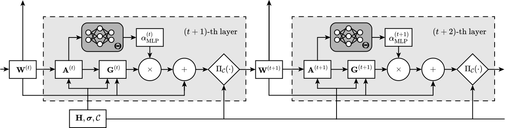

# MM-Net: Recurrent Unfolding with Adaptive Majorization for Weighted Sum-Rate Beamforming

This repository contains the Python implementation of the algorithms presented in the paper:

> **MM-Net: Recurrent Unfolding with Adaptive Majorization for Weighted Sum-Rate Beamforming**  
> Zhexian Yang, Zepeng Zhang, Ziping Zhao



The project provides optimization-based and deep learning-based methods for weighted sum-rate (WSR) maximization in MIMO broadcast channels. It includes:
- Classical WMMSE and MM algorithms
- A deep unfolded network (MM-Net) that learns the step size parameters to speed up convergence

A comparison between MM-Net and other unfolding-related articles is presented in the following table.

**Table 1:** Comparisons of different learning-based methods. <a id="table1"></a>

| Method                                                           | Network Type | Algorithm Prototype                                 | Channel Setting | Constraint  |
| ---------------------------------------------------------------- | ------------ | --------------------------------------------------- | --------------- | ----------- |
| MLP [<a href="#ref11">11</a>]                                    | MLP          | N/A                                                 | SISO            | flexible    |
| CNN  [<a href="#ref12">12</a>,<a href="#ref19">19</a>]           | CNN          | N/A                                                 | MISO            | total power |
| IAIDNN [<a href="#ref15">15</a>,<a href="#ref20">20</a>]         | unfolded NN  | WMMSE [<a href="#ref5">5</a>,<a href="#ref6">6</a>] | MIMO            | total power |
| WMMSE-Net [<a href="#ref16">16</a>,<a href="#ref21">21</a>]      | unfolded NN  | WMMSE [<a href="#ref5">5</a>,<a href="#ref6">6</a>] | MISO            | flexible    |
| WMMSE-Net [<a href="#ref17">17</a>]                              | unfolded NN  | WMMSE [<a href="#ref5">5</a>,<a href="#ref6">6</a>] | MIMO            | total power |
| BLN-PGP [<a href="#ref18">18</a>]                                | unfolded NN  | PG                                                  | MISO            | flexible    |
| MM-Net (this work) [<a href="#ref1">1</a>,<a href="#ref2">2</a>] | unfolded RNN | MM [<a href="#ref1">1</a>,<a href="#ref2">2</a>]    | MIMO            | flexible    |

## Repository Structure

```
.
├── README.md
├── WSR_algorithm.py          # Core optimization algorithms
├── unfolding_algorithm.py    # MM-Net implementation
├── one_dimensional_search.py # Auxiliary line-search methods
├── exp_diff_antenna.py       # Experiment: performance vs. number of transmit antennas
├── exp_diff_channels.py      # Experiment: convergence behavior over random channels
├── Store_models/             # Folder containing pre-trained MM-Net models
├── Store_results/            # Output folder for Monte Carlo results
├── figures/                  # Output folder for generated plots
└── images/                   # Images in README.md
```

## Requirements

- Python 3.12
- NumPy
- PyTorch 2.7.0
- Matplotlib
- Joblib

Install dependencies with:

```bash
pip install torch>=2.7.0 numpy matplotlib joblib
```

## Pre-trained Models

The MM-Net requires pre-trained neural networks for step-size prediction.  

For each scenario (`N_t`, `K`, `max_iter`, `SNR`), a model file named  
`model_Diag_{N_t}Nt_{K}K_{max_iter}T_{SNR}dB.pth` should be placed inside the `Store_models/` directory.

## Usage

### Quick Test

To verify the algorithms on a single random channel, run:

```bash
python WSR_algorithm.py
```

This will generate convergence and runtime plots for WMMSE and MM.

### Reproducing Paper Results

#### Experiment 1: Varying Number of Transmit Antennas

```bash
python exp_diff_antenna.py
```

This script performs 1000 Monte Carlo runs for each antenna configuration (from 4 to 128) and saves the results in `Store_results/diff_antennas.pkl`.  

After execution, it plots WSR and CPU time versus the number of transmit antennas.

> **Note:** This experiment may take several minutes to complete. You can reduce the number of Monte Carlo runs by modifying `num_monte_carlo` in the script.

#### Experiment 2: Convergence Behavior Over Channels

```bash
python exp_diff_channels.py
```

This script runs 1000 Monte Carlo simulations for a fixed antenna setup (e.g., 128 transmit antennas, 4 users) and saves the averaged convergence curves.  

It produces two figures:
- WSR vs. iteration
- WSR vs. CPU time

The results are stored as `Store_results/monte_carlo_{N_t}Nt_{K}K_{max_iter}T_{SNR}dB.pkl`.

### Customizing Parameters

You can adjust system parameters (number of users, antennas, SNR, etc.) directly inside the experiment scripts. The main parameters are:

- `K`: number of users
- `N_t`: number of transmit antennas
- `N_r`: number of receive antennas
- `N_s`: number of data streams
- `SNR`: signal-to-noise ratio (dB)
- `max_iter`: maximum number of iterations
- `num_monte_carlo`: number of Monte Carlo trials

## Contact

For questions or issues, please open an issue on GitHub or contact zhexianyang@shanghaitech.edu.cn

---

## References
- <a id="ref1">[1]</a> Z. Zhang, Z. Zhao, and K. Shen, "Enhancing the Efficiency of WMMSE and FP for Beamforming by Minorization-Maximization," in *ICASSP 2023*, pp. 1–5, 2023. [↑](#table1)
- <a id="ref2">[2]</a> Z. Zhang, Z. Zhao, K. Shen, D. P. Palomar, and W. Yu, "Discerning and Enhancing the Weighted Sum-Rate Maximization Algorithms in Communications," *arXiv preprint arXiv:2311.04546*, 2023. [↑](#table1)
- <a id="ref5">[5]</a> S. S. Christensen, R. Agarwal, E. De Carvalho, and J. M. Cioffi, "Weighted Sum-Rate Maximization using Weighted MMSE for MIMO-BC Beamforming Design," *IEEE Transactions on Wireless Communications*, vol. 7, no. 12, pp. 4792–4799, 2008. [↑](#table1)
- <a id="ref6">[6]</a> Q. Shi, M. Razaviyayn, Z.-Q. Luo, and C. He, "An Iteratively Weighted MMSE Approach to Distributed Sum-Utility Maximization for a MIMO Interfering Broadcast Channel," *IEEE Transactions on Signal Processing*, vol. 59, no. 9, pp. 4331–4340, Sep. 2011. [↑](#table1)
- <a id="ref11">[11]</a> H. Sun, X. Chen, Q. Shi, M. Hong, X. Fu, and N. D. Sidiropoulos, "Learning to Optimize: Training Deep Neural Networks for Interference Management," *IEEE Transactions on Signal Processing*, vol. 66, no. 20, pp. 5438–5453, Oct. 2018. [↑](#table1)
- <a id="ref12">[12]</a> W. Xia, G. Zheng, Y. Zhu, J. Zhang, J. Wang, and A. P. Petropulu, "A Deep Learning Framework for Optimization of MISO Downlink Beamforming," *IEEE Transactions on Communications*, vol. 68, no. 3, pp. 1866–1880, Mar. 2020. [↑](#table1)
- <a id="ref15">[15]</a> Q. Hu, Y. Cai, Q. Shi, K. Xu, G. Yu, and Z. Ding, "Iterative Algorithm Induced Deep-Unfolding Neural Networks: Precoding Design for Multiuser MIMO Systems," *IEEE Transactions on Wireless Communications*, vol. 20, no. 2, pp. 1394–1410, Feb. 2021. [↑](#table1)
- <a id="ref16">[16]</a> L. Pellaco, M. Bengtsson, and J. Jalden, "Matrix-Inverse-Free Deep Unfolding of the Weighted MMSE Beamforming Algorithm," *IEEE Open Journal of the Communications Society*, vol. 3, pp. 65–81, 2022. [↑](#table1)
- <a id="ref17">[17]</a> L. Pellaco and J. Jalden, "A Matrix-Inverse-Free Implementation of the MU-MIMO WMMSE Beamforming Algorithm," *IEEE Transactions on Signal Processing*, vol. 70, pp. 6360–6375, 2022. [↑](#table1)
- <a id="ref18">[18]</a> M. Zhu, T.-H. Chang, and M. Hong, "Learning to Beamform in Heterogeneous Massive MIMO Networks," *IEEE Transactions on Wireless Communications*, vol. 22, no. 7, pp. 4901–4915, Jul. 2023. [↑](#table1)
- <a id="ref19">[19]</a> H. Hojatian, J. Nadal, J.-F. Frigon, and F. Leduc-Primeau, "Unsupervised Deep Learning for Massive MIMO Hybrid Beamforming," *IEEE Transactions on Wireless Communications*, vol. 20, no. 11, pp. 7086–7099, Nov. 2021. [↑](#table1)
- <a id="ref20">[20]</a> A. Chowdhury, G. Verma, A. Swami, and S. Segarra, "Deep Graph Unfolding for Beamforming in MU-MIMO Interference Networks," *IEEE Transactions on Wireless Communications*, vol. 23, no. 5, pp. 4889–4903, May 2024. [↑](#table1)
- <a id="ref21">[21]</a> C. Xu, Y. Jia, S. He, Y. Huang, and D. Niyato, "Joint User Scheduling, Base Station Clustering, and Beamforming Design Based on Deep Unfolding Technique," *IEEE Transactions on Communications*, vol. 71, no. 10, pp. 5831–5845, Oct. 2023. [↑](#table1)

